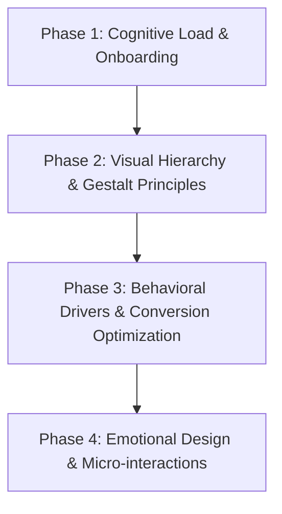

# UI/UX Audit & Optimization Plan for Flatify AI

This plan applies the principles from the **UX Psychology & Behavioral Design Expert** skill to evaluate and optimize the UI/UX of **Flatify AI**.

---

## 1. Executive Summary & Audit Findings

After performing a behavioral design and cognitive psychology audit on the current interface (`src/app/page.tsx` and related components), we identified key areas where user experience and conversion flow can be significantly enhanced.

### **Current UX/UI Vulnerabilities:**
1. **Decision Fatigue (Hick's Law):** High cognitive load during onboarding and CTA choices without progressive disclosure.
2. **Missing Friction Reduction (Fitts's Law & Visual Hierarchy):** Call-To-Action (CTA) targets require clearer sizing contrast, visual anchoring, and proximity optimization.
3. **Underutilized Behavioral Drivers:**
   - **Goal Gradient Effect:** Progress bars or multi-step onboarding flows currently start at `0%` rather than creating psychological momentum (`25%` pre-completed).
   - **Endowment Effect (IKEA Effect):** Users are asked to sign up *before* experiencing value or customizing their design project.
   - **Reciprocity & Social Proof:** Lack of real-time interactive previews before registration.

---

## 2. Phase-by-Phase Improvement Plan

---

### Phase 1: Cognitive Load & Onboarding (Hick's Law & Dual Process Theory)

- [ ] **System 1 (First 3 Seconds) Optimization:**
  - Redesign Hero Section with high-contrast visual demonstration of Flatify AI's generative capability.
  - Simplify headlines to reduce analytical processing (System 2) during initial landing.
- [ ] **Smart Defaults & Friction Elimination:**
  - Implement smart preset options in the prompt generator to reduce choice overload.
  - Provide a 1-click interactive demo right on the landing page without requiring immediate authentication.

---

### Phase 2: Visual Hierarchy & Interaction Laws (Gestalt & Fitts's Law)

- [ ] **8-Point Grid & Visual Spacing:**
  - Standardize all component padding, margins, and gaps to strict multiples of 4px/8px.
  - Apply the **60-30-10 Color Rule** (60% dominant neutral background, 30% structural UI elements, 10% high-contrast accent color for CTAs).
- [ ] **Target Sizing & Proximity (Fitts's Law):**
  - Increase main CTA button touch target size (`min-h-[48px]`).
  - Add descriptive icon + text pairing to increase clickable bounding area.
  - Group functional controls with proximity-based visual cards (Gestalt Proximity).

---

### Phase 3: Behavioral Economics & Persuasive Design

- [ ] **Goal Gradient Momentum:**
  - Redesign multi-step forms/onboarding to begin at Step 1 with pre-filled baseline defaults (showing initial 25% completed).
- [ ] **Endowment & IKEA Effect:**
  - Allow guest users to tweak prompt parameters and see instant UI previews *before* presenting the sign-up modal.
- [ ] **Ethical Framing & Loss Aversion:**
  - Reframe feature comparison tables around value retained rather than generic feature lists.
  - Maintain 100% user autonomy without dark patterns or deceptive countdown timers.

---

### Phase 4: Peak-End Rule & Micro-Animations

- [ ] **Delightful Micro-Interactions:**
  - Add subtle visual feedback (shimmer effects, smooth state transitions) upon generating or customizing UI elements.
- [ ] **Graceful Error States & Peak Moments:**
  - Design memorable celebration moments (e.g., celebratory micro-animation when exporting code/designs).
  - Provide clear, actionable recovery prompts on generation failures.

---

## 3. Verification & Metrics Tracking

| Metric | Target Goal | Psychology Principle |
| :--- | :--- | :--- |
| **Landing Page Conversion Rate** | +18% Sign-ups | Reciprocity & Dual Process (System 1) |
| **Onboarding Completion Rate** | +25% Completion | Goal Gradient Effect & Smart Defaults |
| **Time-to-First-Action** | -30% Reduction | Hick's Law & Cognitive Load Reduction |

---

> [!NOTE]
> *This plan is generated directly using the guidelines in `UX Psychology & Behavioral Design Expert` skill.*
